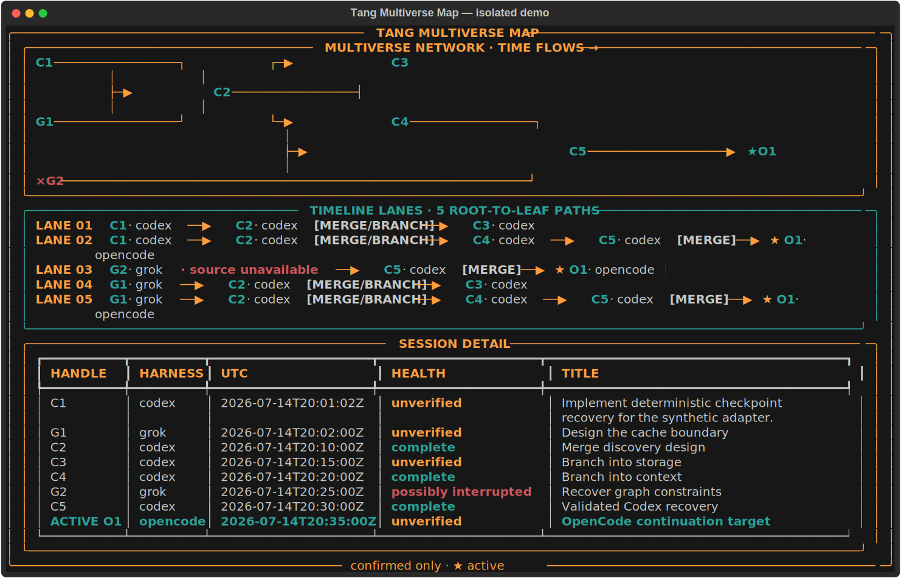

# Tang Multiverse

<table>
<tr>
<td width="68%" valign="top">
<strong>Keep the blade, switch the handle.</strong><br><br>
<strong>Continue one coding agent's work inside another, with the original sources cited.</strong><br><br>
Bring one session or many from Grok, Codex, or OpenCode into your current
handle. Tang preserves every explicitly confirmed continuation in a
terminal-native Multiverse Map—whether you start from Codex, OpenCode, or the
same CLI in a normal terminal.<br><br>
<strong>Across Grok, Codex, and OpenCode today—with every continuation explicitly confirmed.</strong>
</td>
<td width="32%" align="right" valign="top">

</td>
</tr>
</table>

## The Multiverse Map

**The graph is the product's proof, not decoration.**

Every edge means recovered context actually continued into another session.
Several sources can merge into a target; any session can later branch into
several targets. Across repeated continuations, that creates a many-to-many
directed graph. Tang does not invent relationships.

```text
  A · Grok research ──┐                    ┌──▶ D · Codex API
                      ├──▶ C · Codex plan ─┤
  B · Codex review ───┘                    └──▶ E · Codex CLI ──┐
                                                               ├──▶ G · Codex hardening
  F · Grok testing ─────────────────────────────────────────────┘    ACTIVE HANDLE
```

The final terminal view highlights the active handle and remains understandable with `NO_COLOR`, narrow terminals, and ASCII-only connectors.



This capture comes from the real isolated `tang demo` output. From a development
checkout, regenerate it with `python scripts/capture_demo_hero.py --tang
.venv/bin/tang --output docs/assets/tang-multiverse-demo.svg`.

> **v0.2.9 is the reviewed Linux release:** the complete demo path and OpenCode
> source/destination integration are verified in source, then separately
> smoke-tested from the matching wheel. The source repository is public and the
> immutable version-pinned artifact is available below.

## The work should outlive the tool

A good blade does not become useless because you changed the handle. Your work should not either.

Coding harnesses can usually reopen their own sessions, but the continuity stops at the product boundary. Start a difficult task in Grok, move to Codex, and the decisions, constraints, dead ends, and next action are stranded in the old handle.

Tang is the fitted continuity layer:

- **The blade** is the work itself.
- **The handles** are Codex, Grok, OpenCode, and future supported harnesses.
- **The tang** is the part that lets the same work seat securely in a new handle.

Tang finds the prior session, rereads the native source, redacts it, builds a
compact Context Pack with citations, and helps the active agent establish an
evidence-backed resume point. It then records only the continuations you
confirm.

One source into one target is recovery. Many sources feeding many later
sessions become continuity. A later Codex or OpenCode session can merge more
Grok, Codex, or OpenCode sources, branch into several future sessions, and
extend the same Multiverse without flattening its history.

## Start where you already work

Invoke `$tang` in Codex, `/tang` in OpenCode, or run the same `tang` commands
directly in a terminal. The filmed path leads Grok to Codex; the shipped
workflow also recovers OpenCode sources and can continue into a confirmed
OpenCode session. Each action selects one source or many into one confirmed
current target; repeating that action across later targets creates the
many-to-many Multiverse:

1. Open Tang in the current Codex or OpenCode project, or run the CLI there.
2. Find a prior Grok session by a phrase you remember.
3. Preview its small, redacted Discovery Capsule.
4. Select it and build a compact, source-cited Context Pack.
5. Let GPT-5.6 state the evidence-backed **Resume point** and **Next action**.
6. Confirm the continuation and reveal it in the Multiverse Map.
7. Continue C into D and E, merge E with another source F into G, and watch the many-to-many graph grow.

No transcript copy-and-paste. No pretending that a generic summary is provenance. No edge until the continuation is confirmed.

## Install on Linux

Install the immutable, version-pinned v0.2.9 wheel:

```bash
uv tool install https://github.com/DonnieFi/tang/releases/download/v0.2.9/tang_multiverse-0.2.9-py3-none-any.whl
tang skill install codex
tang --help
```

Requirements: Linux and Python 3.11 or later. The hackathon release makes no macOS or Windows compatibility claim.

For local development, install a wheel you built yourself instead:

```bash
uv tool install ./tang_multiverse-0.2.9-py3-none-any.whl
tang skill install codex
tang --help
```

The clean-wheel path is tested on Linux x86-64 with Python 3.11.11 and 3.12.8.
The skill is bundled with the wheel so its instructions and CLI contract stay
on the same version. Start a new Codex session, invoke `$tang`, or ask Codex in
plain English to use Tang. Tang is a Codex skill, not a `/tang` slash command;
the slash-command picker is not expected to list it.

For OpenCode `>=1.17.18,<2.0.0` on Linux, install the project-local
integration, restart OpenCode in that project, and invoke `/tang`:

```bash
tang skill install opencode --project-root "$PWD"
```

The OpenCode command, skill, and private current-target bridge are bundled with
the same Tang wheel. Tang reads supported OpenCode transcripts independently
of the model provider used for that session.

After an explicitly confirmed continuation, `$tang context` in Codex or
`/tang context` in OpenCode recalls the active session's confirmed predecessors
and writes the cited Continuation Brief in one turn. It never creates a link.

### Choose your entry point

- **Codex:** install the bundled skill with `tang skill install codex`, start a
  new session in the project, then invoke `$tang` or ask in plain English.
- **OpenCode:** install the project-local integration above, restart OpenCode
  in that project, then invoke `/tang`.
- **Grok:** no Tang plugin is installed in Grok for v0.2; its local history is a
  supported read-only source. Run `tang index` from the project terminal—or
  from Codex or OpenCode—to recover it into the current supported target.
- **CLI:** `tang index`, `browse`, `search`, `context`, `link`, `graph`, and
  `resume` are the same scriptable commands from either host or a normal
  project terminal. `tang resume HANDLE` reopens an indexed Codex or OpenCode
  session through its native CLI.

For download verification, uninstall instructions, a plain-English
walkthrough, and FAQs, see [`docs/getting-started.md`](docs/getting-started.md).

## Three moves

### 1. Find the work

Tang indexes small Discovery Capsules for the current project. Search by harness, time, health signal, or the half-remembered phrase that is still stuck in your head.

### 2. Continue here

Choose one or more source sessions from Grok, Codex, or OpenCode. Tang rereads
and redacts the native sources, fairly allocates a compact Context Pack across
them, and cites every recovered excerpt. The active agent uses that evidence
without treating recovered transcript text as instructions.

### 3. See the Multiverse

Confirm the continuation. Tang records explicit, cycle-free edges. Repeated many-source operations across later target sessions form a many-to-many DAG, rendered as the Multiverse Map.

Use the skill when you want guided, host-native selection; use the CLI when you
already know a handle or need a scriptable path.

## What Tang supports

| Harness or platform | Hackathon release | Claim |
|---|---:|---|
| Codex CLI 0.144.4 | Supported on Linux | Representative local store live-verified; read-only source adapter and current continuation target |
| Grok 0.2.99 | Supported on Linux | Representative local store live-verified; read-only source adapter |
| OpenCode `>=1.17.18,<2.0.0` | Supported on Linux | Runtime contracts fail closed; 1.17.20 live-verified with OpenAI- and xAI-backed sessions; read-only source adapter and explicitly confirmed current continuation target |
| Linux x86-64 | Supported | Clean-wheel acceptance on Python 3.11.11 and 3.12.8; synthetic fixture coverage in CI |
| macOS | Unsupported | No compatibility or CI claim |
| Windows | Unsupported | No native compatibility claim |

Within the documented OpenCode range, Tang still validates the native catalog
and export shapes on every use and fails closed on incompatible data. Tang makes
no compatibility claim for OpenCode versions outside that range, or for other
Codex and Grok versions without separate evidence.

The longer-term product direction is symmetrical continuity: any supported
handle should be able to receive the blade. Tang v0.2 supports repeated,
multi-source continuation into explicitly confirmed Codex and OpenCode targets;
Grok remains a read-only source. Tang never writes recovered transcript text
into a native harness.

## The incident that started it

Tang began while trying Sol outside Codex as a test in another coding harness.
That harness will remain unnamed. The session crashed while producing a
specification; the work appeared lost, was difficult to locate, and eventually
had to be recovered by another agent.

That incident supplied the question—why is valuable work trapped inside the
handle that created it?—not a support claim. Tang's demonstrated path starts
with Grok-to-Codex continuity; the completed product also supports OpenCode as
a source and an explicitly confirmed destination.

## Local-first, deliberately

Native harness logs remain the source of truth. Tang stores only derived continuity data needed for discovery and the graph.

- Each canonical project owns its local SQLite database at `.tang/tang.db`; Tang creates it with user-only permissions (`0700` directory, `0600` database) on supported POSIX systems.
- Discovery Capsules contain at most 8 KiB of redacted visible text per session.
- Browse and JSON discovery also show bounded session headers when native evidence
  exists: model/provider, Codex effort, visible-turn count, approximate visible
  text size, and whether the title is native or derived. These facts are
  harness-dependent, not a uniform metadata promise. Tang does not persist a
  generated session summary.
- System prompts, hidden reasoning, tool payloads, tool results, file bodies, and full transcripts are excluded.
- Selected native sources are reread and redacted when a Context Pack is created.
- Recovered content is wrapped as untrusted historical evidence, never executable instruction.
- `tang purge --all` removes all Tang-derived records for the current project, including stored source paths;
  it leaves an empty secure SQLite container for reuse and never deletes or
  rewrites the native harness logs that remain the source of truth.
- `tang demo` uses a temporary data directory and must not touch native logs or the user's normal project Tang database.

Redaction reduces accidental disclosure; it is not encryption and does not promise protection against forensic recovery.

## How it fits together

```text
 native Codex logs    native Grok data    OpenCode export
          │                   │                   │
          └────────── read-only adapters ─────────┘
                              │
                              ▼
                     redaction boundary
                              │
            ┌─────────────────┴─────────────────┐
            ▼                                   ▼
    Discovery Capsules                  selected source reread
     SQLite + FTS5                               │
            │                                    ▼
            └──── find and select ──────▶ Context Pack
                                                  │
                                                  ▼
                                      evidence-backed agent brief
                                                  │
                                       confirmed continuation
                                                  ▼
                                           Multiverse Map
```

Adapters own native parsing and expose two deep operations: scan for discoverable sessions, and reread a selected session. Tang's core owns project boundaries, redaction, search, context budgets, continuation rules, and presentation.

The concise architecture decisions and their consequences live in
[`CONTEXT.md`](CONTEXT.md); the approved product contract remains
[`docs/tangspec.md`](docs/tangspec.md).

## Command line

The installed Tang skill is the primary interactive experience in Codex and
OpenCode. The CLI stays scriptable and does not introduce a competing selector.

| Command | Purpose |
|---|---|
| `tang index` | Incrementally index sessions for the current project |
| `tang browse [--page N]` | Show up to five numbered, redacted sessions with short project handles such as `C1` or `G2` |
| `tang search QUERY [--page N] [--limit N]` | Search redacted Discovery Capsules and show numbered choices; simple keywords or quoted phrases are recommended |
| `tang context [SESSION...]` | Produce a compact Markdown or JSON Context Pack; bare context and `context all` recall confirmed predecessors of the latest unambiguous target, while `context N` limits link depth |
| `tang link --from SESSION... --current` | Record selected sources into an explicitly confirmed current Codex session |
| `tang link --from SESSION... --to SESSION` | Record selected sources into an explicitly confirmed target, including the OpenCode skill's current target |
| `tang graph [SESSION]` | Render the containing Multiverse Map |
| `tang resume SESSION` | Reopen one indexed Codex or OpenCode session by its Tang handle |
| `tang purge --all` | Remove Tang-derived data after confirmation |
| `tang doctor` | Check installation, database, FTS5, and adapter readiness without creating absent derived storage |
| `tang skill install codex` | Install or update the bundled Codex skill without silently overwriting changes |
| `tang skill install opencode --project-root PATH` | Install or update the bundled project-local OpenCode skill, `/tang` command, and current-target bridge |
| `tang demo` | Run the isolated synthetic judge demonstration |

Human-readable output goes to `stdout`; diagnostics go to `stderr`. JSON output uses deterministic ordering, RFC 3339 UTC timestamps, and `schema_version: 1`.
`tang index` exits with status 1 when indexing is partial so automation can detect
degraded results without parsing its output. JSON and stderr distinguish
project-impacting `warnings` from `diagnostic[foreign]` records: a malformed
session proven to belong to another project remains visible without degrading
the active project's successful index.

Human `browse` and `search` show at most five numbered choices per page with a
short project-local handle (`C1` for Codex, `G1` for Grok, or `O1` for
OpenCode), redacted display
name, harness, time, health, capability, and snippet. Use `--page 2` for the
next page. Pass those case-insensitive handles directly to `context`, `link`,
or `graph`. Handles remain stable in the project's `.tang/tang.db`; `purge
--all` resets them with all other derived data. JSON retains the exact
`source_id` for scripts and the Codex skill's private selection mapping.
Search returns up to 20 results by default; use `--limit N` (1-100) when a
larger current-project result set is useful before paging.

Continuation is never automatic. After selecting sources and reviewing the
Context Pack, confirm one target and run `tang link`; then use `tang graph` on
the returned target to see the recorded continuity. Replaying the same
confirmed link is idempotent and reports an existing edge rather than creating
another. The canonical command is `link`: if you try `tang connect`, Tang
points you to `tang link --help` instead of registering a second workflow.

## Judge path

After installing either the reviewed local wheel or the published tagged wheel:

```bash
tang demo
```

For a redirected text capture, force the wide woven layout explicitly:

```bash
tang demo --width 120 --unicode > tang-demo.txt
```

`--unicode` forces Unicode connectors but does not fabricate terminal color.
For a saved capture, use `tang demo --width 120 --unicode --color always >
tang-demo.txt` or `tang graph C1 --width 120 --unicode --color always >
tang-graph.txt`; under normal use, `auto` respects `NO_COLOR` and the
terminal. `scripts/capture_demo_hero.py` remains the repeatable README-asset
path.

Run `tang doctor` separately when you want component-by-component readiness.
Before the first real project index, its expected `database: not_initialized`
result is informative rather than a demo failure.

The demo copies only bundled synthetic Codex and Grok fixtures into a temporary
workspace, indexes and searches them, builds a two-source cited Context Pack,
maps those exact sources into a branch-and-merge DAG, then confirms the final
continuation into a synthetic OpenCode target before rendering the active
Multiverse and deleting the workspace. On the clean-wheel
Linux gate runs kept search and Context Pack generation under 0.2 seconds each,
the search/context/link/graph core under 0.6 seconds, and the complete isolated
demo under 2 seconds. These are observed release-host timings, not universal
performance guarantees.

For a filmed, real-session rehearsal, use the [video runbook](docs/video-runbook.md)
to prepare isolated source sessions and the [voice-over script](docs/demo_script.md)
as a separate narration track.

Release-candidate reviewers can run the isolated clean-wheel acceptance script
from a matching source checkout. It records the wheel hash, environment, exit
codes, privacy checks, and timings as JSON without reading native user history:

```bash
python3 scripts/functional_acceptance.py \
  ./tang_multiverse-0.2.9-py3-none-any.whl \
  --output tang-functional-evidence.json
```

OpenCode support is covered by sanitized contract fixtures, provider-independent
live transcript evidence, target-confirmation tests, and the installed `/tang`
workflow. The isolated judge demo keeps its focused Grok-to-Codex recovery
story and visibly ends with a confirmed OpenCode continuation target.

## Built with Codex and GPT-5.6

Codex helped recover and interrogate the session that inspired Tang, pressure-test the product scope, turn the approved specification into a dependency-aware Beads plan, and implement the release through dated, reviewable milestones. Human gates retain control over support claims, privacy tradeoffs, scope changes, and every epic promotion.

GPT-5.6 has two visible roles:

- **Building Tang:** the majority of core implementation is developed in one recorded Codex project thread, with dated commits and a submitted `/feedback` session ID.
- **Inside Tang:** GPT-5.6 turns a deterministic, source-cited Context Pack into the concise resume point and next action a developer needs after changing harnesses. Tang keeps retrieval, redaction, citations, and graph edges deterministic.

Majority-core Codex thread and `/feedback` evidence ID:
`019f62b2-5a7d-75c3-922d-969b182ec9a2`.

Concrete collaboration examples include turning live native-store observations
into three tested read-only adapters, using adversarial review to harden poisoned
checkpoints and fair multi-source allocation, and converting functional-host
feedback into project-local storage, faster unchanged refresh, paged discovery,
short linkable session handles, and the provider-independent OpenCode workflow.
Humans made the material calls: prove the Grok-to-Codex wedge before broader
adapters, never infer continuation edges, keep native logs authoritative, move
derived storage into each project, and require a manual gate before every epic
promotion. Those choices are dated in [`decision.md`](decision.md).

## Why not ordinary session resume?

| Approach | Reopens the same tool's session | Crosses harnesses | Source-cited recovered context | Confirmed continuation graph |
|---|---:|---:|---:|---:|
| Native session resume | Yes | No | Not applicable | No |
| Manual history hunting | Sometimes | By copy/paste | Manual | No |
| Transcript export | As static text | Sometimes | Varies | No |
| Tang | **Yes, by exact indexed handle** | **Yes** | **Yes** | **Yes** |

`tang resume HANDLE` launches only the exact selected Codex or OpenCode session
through that harness's native CLI. It does not inject another transcript, build
a Context Pack, infer an edge, or remote-control a running harness. Tang's
cross-harness wedge remains source-cited recovery plus explicit continuation.

## Roadmap

After the v0.2 path is proven:

- opt-in cross-project discovery
- custom Context Pack budgets
- richer graph exports and themes
- performance work for larger OpenCode catalogs and dense graph timelines
- compatibility-preserving architectural hardening already tracked for Epic 8

## Contributing and license

Issues and focused pull requests are welcome. Set up a development checkout
with `uv sync --group dev`, run `uv run pytest -q`, and keep changes inside the
approved scope in [`docs/tangspec.md`](docs/tangspec.md). New adapter or
platform claims require representative live evidence, sanitized fixtures, and
failure-path tests. Never contribute native transcripts, credentials, private
paths, third-party logos, or a database built from real user history.

Tang is licensed under the [`MIT License`](LICENSE). v0.2.9 is the reviewed,
tagged Linux release.
Report security issues privately using the process in
[`SECURITY.md`](SECURITY.md); never attach native transcripts or credentials to
a public issue.

---

**Keep the blade, switch the handle.**
